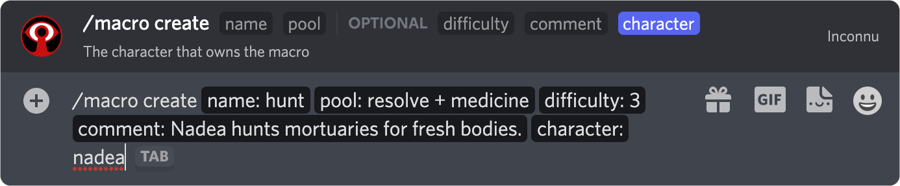

# Macros

Another of **Inconnu's** advanced features is macro support. A macro is a time-saving command that allows you to save a pool and optional difficulty for later use. For example, you might save a `hunt` command that uses your `Resolve + Medicine` traits, or you might make a `summon_spirit` macro that rolls `Resolve + Oblivion` at difficulty `2`, automatically performs a Rouse check, and even applies a stain if that Rouse check results in a 1 or a 10. Used this way, macros speed up your play by reducing the number of times you have to crack open the book.

?> **No Hunger?** Due to the frequency at which Hunger changes throughout normal play, macros do not track Hunger. However, when you call a macro, you can supply Hunger on the spot.

All macro management is done through the `/macro` application command prefix. As you begin typing, Discord should automatically show a list of command options above your textbox. Simply click/tap the one you want (or continue to type in the name). On the desktop, you can tab through command parameters, while mobile lets you tap through.

## Creation

```
/macro create name:<name> pool:<pool> hunger:[Yes/No] difficulty:[difficulty] comment:[comment] character:[character]
```

| Parameter       | Description                                     | Notes
|-----------------|-------------------------------------------------|-------
| `name`          | The name of the macro                           | A-Z plus underscores
| `pool`          | The pool and (optional) difficulty for the roll |
| `hunger`        | Whether to use Hunger in the roll               |
| `difficulty`    | The roll's difficulty (default 0)               | Default 0
| `rouses`        | The number of Rouse checks to make              | Default 0
| `reroll_rouses` | Whether to re-roll the macro's Rouse checks     | Default `No`
| `staining`      | Whether to give a stain on a 1 or 10            | Default `No`
| `comment`       | A comment to add when rolling                   | Optional
| `character`     | The character who owns the macro                |

?> `pool` follows the same syntax as standard [rolls](rolls.md#basic-syntax) and may include traits.

?> **Automatic rouse checks:** If `rouses` is greater than 0, **Inconnu** will automatically make an appropriate number of Rouse checks when you use the macro. `reroll_rouses` will have no effect if `rouses` is equal to 0.

!> Macro names may not exceed 50 characters. Macro comments may not exceed 300 characters.

**Example:** Creating a macro:



[filename](includes/character-requirement.md ':include')

## Updating

```
/macro update macro:MACRO parameters:PARAMETERS character:CHARACTER
```

| Parameter    | Description                                               |
|--------------|-----------------------------------------------------------|
| `macro`      | The name of the macro to update                           |
| `parameters` | The `KEY=VALUE` pairs                                     |
| `character`  | The character who owns the macro                          |

The `parameters` are the same as in macro creation.

| Key             | Description                                 | Notes                |
|-----------------|---------------------------------------------|----------------------|
| `name`          | The macro's new name                        | A-Z plus underscores |
| `pool`          | The replacement pool                        | Must be a valid pool |
| `hunger`        | Whether to use Hunger in the roll           | "Yes" or "No"        |
| `difficulty`    | The roll's difficulty                       | Must be 0 or higher  |
| `rouses`        | The number of Rouse checks to make          | Must be 0-3          |
| `reroll_rouses` | Whether to re-roll the macro's Rouse checks | "Yes" or "No"        |
| `comment`       | A comment to add when rolling               |                      |

?> Multiple keys can be set at once. For instance: `pool=Strength + Brawl + 1 difficulty=2`.

## Retrieval

This command will list all macros owned by a given character.

```
/macro list character:[character]
```

| Parameter   | Description                                   |
|-------------|-----------------------------------------------|
| `character` | The character of interest                     |

**Example:**


[filename](includes/character-requirement.md ':include')

## Deletion

```
/macro delete <macro> [character]
```

| Parameter   | Description                                   |
|-------------|-----------------------------------------------|
| `macro`    | The pool and (optionally) hunger for the roll  |
| `character` | The character who owns the macro              |

**Example:** Deleting Nadea's `hunt` macro:


[filename](includes/character-requirement.md ':include')

## Rolling

```
/vm syntax:<macro_name ...> character:[character]
```

[filename](includes/character-requirement.md ':include')

* At a minimum, `syntax` must begin with the macro name
* To add *Hunger*, add a number 0-5 after the macro name (and any modifiers)
* To add or modify *Difficulty*, add a positive integer after *Hunger*
* You may add modifiers to the macro pool.

**Example:** Rolling Nadea's `hunt` macro, plus one die, at Hunger 4:


?> **Why `/vm`?** Macro rolling does not make use of the `/macro` command family namespace. This is intentional. By keeping macro rolling similar to the general roll command, users can quickly type it without having to choose from a list. If `/vr` means "vampire roll", then `/vm` means "vampire roll macro".
