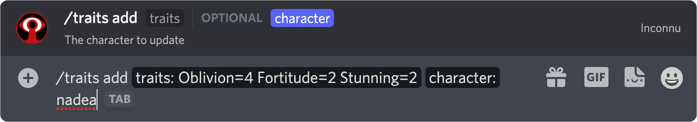
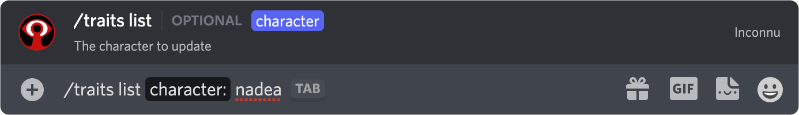
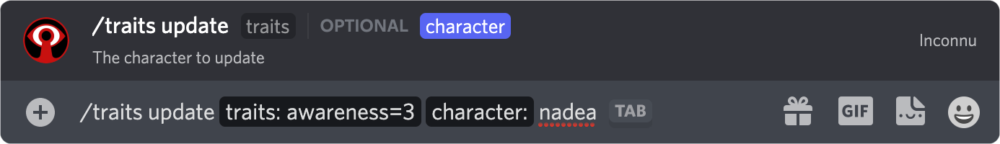
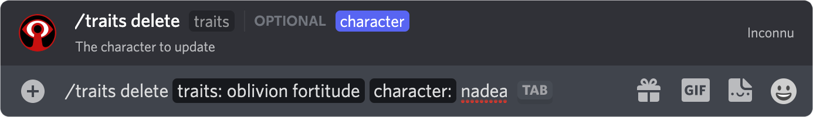

# Trait Management

The following is a detailed reference of **Inconnu's** trait management commands. If this is your first time using **Inconnu**, you are encouraged to read the **[Quickstart](quickstart.md)** first.

[filename](includes/parameter-style.md ':include')

?> For every **Trait** command, the `character` parameter is optional if you only have one character. `character` is always case-insensitive.

All character management is done through the `/traits` application command prefix. As you begin typing, Discord should automatically show a list of command options above your textbox. Simply click/tap the one you want (or continue to type in the name). On the desktop, you can tab through command parameters, while mobile lets you tap through.

## What are traits?

**Inconnu** stores two types of character data: *traits* and *trackers*. A *tracker* is one of the following: Humanity, Health, Willpower, current XP, total XP, Hunger. They describe your character's *state*. Trackers frequently change without spending XP. *Traits*, on the other hand, describe your character's *abilities* and rarely change without investing XP into them. *Traits* are Attributes, Skill, and Disciplines.

## Adding Traits

```
/trait add traits:<trait=rating ...> character:[character]

```

| Parameter   | Description                                               |
|-------------|-----------------------------------------------------------|
| `trait`     | The name of the trait to add                              |
| `rating`    | The trait's rating (Optional)                             |
| `character` | The name of the character being updated                   |

Multiple traits can be added at once.

**Example:** Adding Oblivion 4, Fortitude 2, and Stunning 2 to Nadea:



[filename](includes/incognito-mode.md ':include')

!> If a trait already exists, **Inconnu** will show an error. To update traits, use [this command](#updating-traits) instead.

[filename](includes/universal-traits.md ':include')

## Displaying Traits

This command shows you a list of the character's traits, sorted alphabetically.

```
/traits list character:[character] player:[player]

```

| Parameter   | Description                                       | Notes               |
|-------------|---------------------------------------------------|---------------------|
| `character` | The name of the character whose traits to display | Optional            |
| `player`    | The player who owns the charactor                 | Administrators only |

**Example:** Showing Nadea's traits:



[filename](includes/admin-description.md ':include')

## Updating Traits

```
/traits update traits:<trait=rating ...> character:[character]

```

| Parameter   | Description                                               |
|-------------|-----------------------------------------------------------|
| `trait`     | The name of the trait to update                           |
| `rating`    | The trait's rating (Optional)                             |
| `character` | The name of the character being updated                   |

Multiple traits can be updated at once.

**Example:** Updating Nadea's Awareness trait to 3:



[filename](includes/incognito-mode.md ':include')

!> Unlike rolls, the traits manager requires you to type the full name of the trait in order to update. This prevents accidental assignments.

## Deleting Traits

```
/traits delete traits:<trait ...>  character:[character]

```

| Parameter   | Description                                               |
|-------------|-----------------------------------------------------------|
| `trait`     | The name of the trait to remove                           |
| `character` | The name of the character being updated                   |

You may belete multiple traits at once.

**Example:** Removing Nadea's Oblivion and Fortitude traits:



?> If you delete a core Attribute or Skill, its rating will be set to *0* instead of removing the trait.

!> **Warning:** This operation is permanent. There is no confirmation dialogue.
